# Application Screenshots

Captured on 2026-07-12 from the local React application at `http://localhost:3000` with a desktop viewport of `1440x1100`. Protected pages were captured with an authenticated local admin session against the running development services.

## Page Coverage

| Page | Route | Screenshot | Details |
| --- | --- | --- | --- |
| Login | `/login` | [01-login.png](assets/app-screenshots/01-login.png) | Authentication screen for signing in to the SDK Governance Hub. |
| Executive Overview | `/dashboard` | [02-dashboard.png](assets/app-screenshots/02-dashboard.png) | Leadership dashboard with portfolio health, upgrade posture, LLM usage, operational control boards, and access posture. |
| SDK Portfolio | `/libraries` | [03-libraries.png](assets/app-screenshots/03-libraries.png) | Library inventory and upgrade backlog view for SDK ownership, versions, lifecycle status, and export-ready portfolio details. |
| Upgrade Governance | `/governance` | [04-governance.png](assets/app-screenshots/04-governance.png) | Governance workflow view for upgrade review, approval evidence, lifecycle visibility, and business-rule oversight. |
| Pipeline Operations | `/scheduler` | [05-scheduler.png](assets/app-screenshots/05-scheduler.png) | Scheduler and run-control page for pipeline execution status, retry controls, run history, and operational readiness. |
| Notification Reliability | `/notification-reliability` | [06-notification-reliability.png](assets/app-screenshots/06-notification-reliability.png) | Notification delivery reliability view for channel health, retry signals, delivery activity, and communication assurance. |
| Executive Weekly Digest | `/weekly-digest` | [07-weekly-digest.png](assets/app-screenshots/07-weekly-digest.png) | Business digest page summarizing weekly portfolio activity, governance activity, and leadership-ready outcomes. |
| Application Audit | `/audit` | [08-audit.png](assets/app-screenshots/08-audit.png) | Audit trail for application events, governance evidence, and administrative activity. |
| AI Cost & Performance | `/analytics` | [09-analytics.png](assets/app-screenshots/09-analytics.png) | Analytics page for LLM usage, cost, performance, recommendation-service activity, and model telemetry. |
| Platform Settings | `/settings` | [10-settings.png](assets/app-screenshots/10-settings.png) | Admin settings page for platform telemetry, prompt governance, LLM policy, and business communication configuration. |
| Access Management | `/users` | [11-users.png](assets/app-screenshots/11-users.png) | Admin user management screen for viewer/admin access, activation state, account statistics, and account operations. |

## Screenshots

### Login

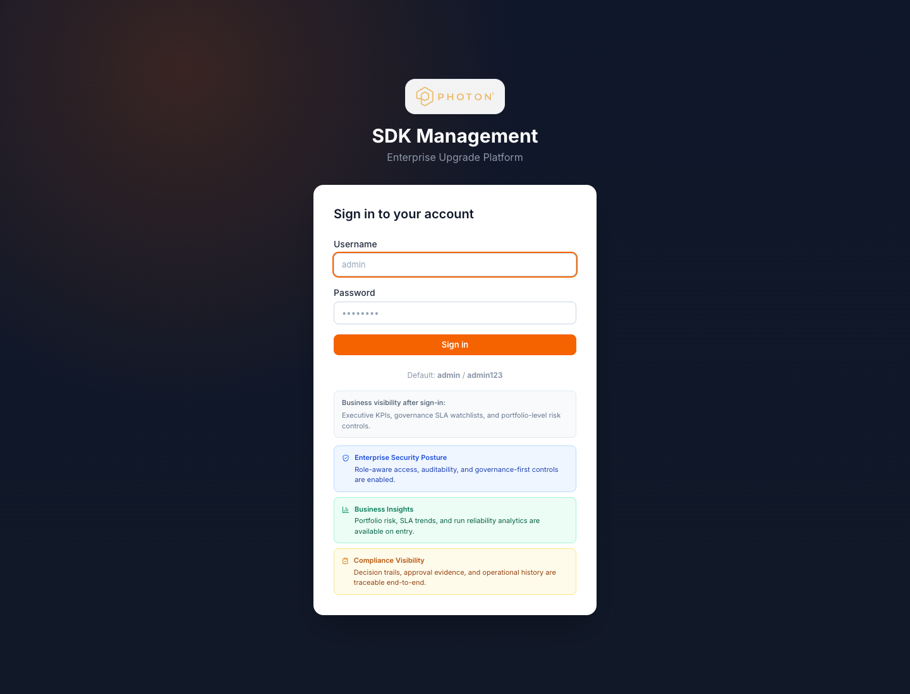

### Executive Overview

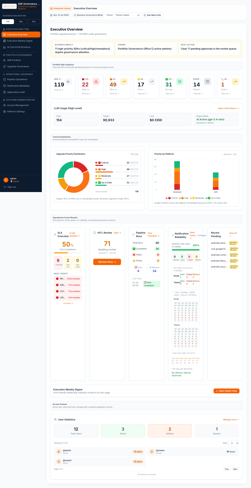

### SDK Portfolio

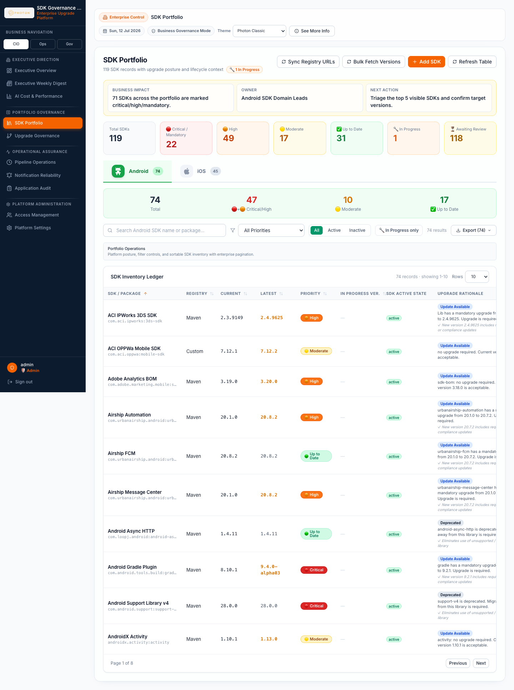

### Upgrade Governance

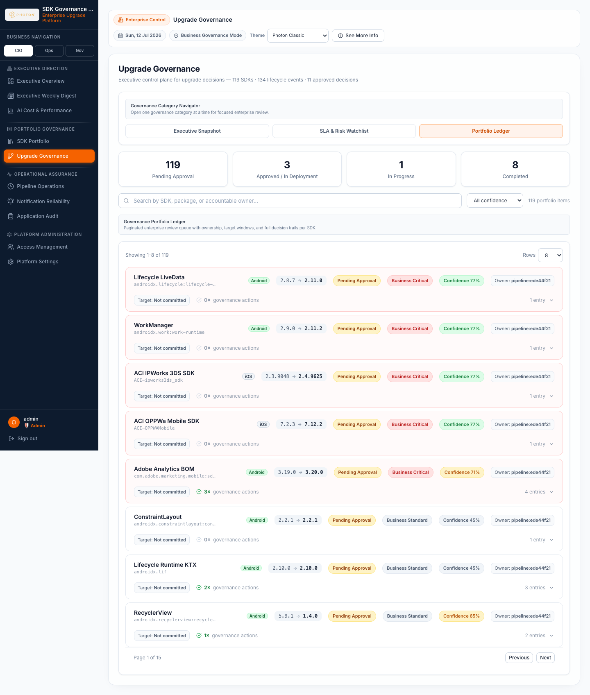

### Pipeline Operations

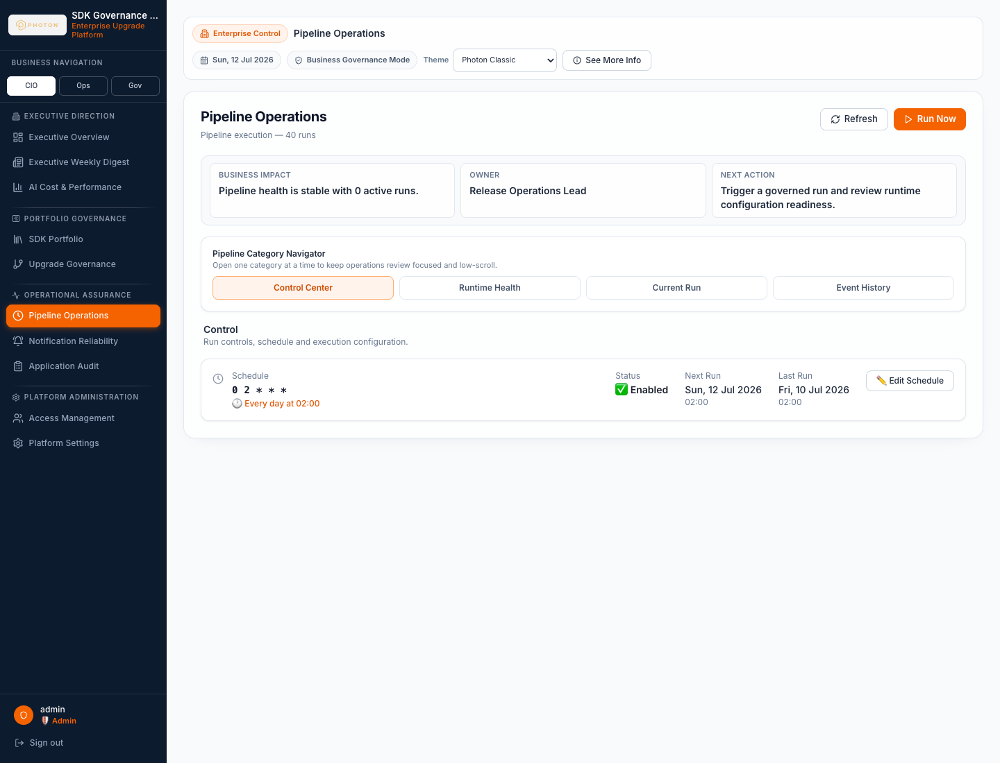

### Notification Reliability

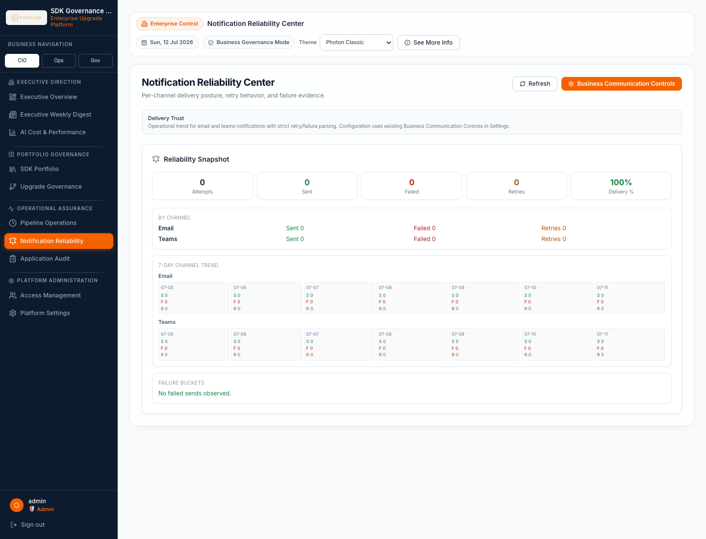

### Executive Weekly Digest

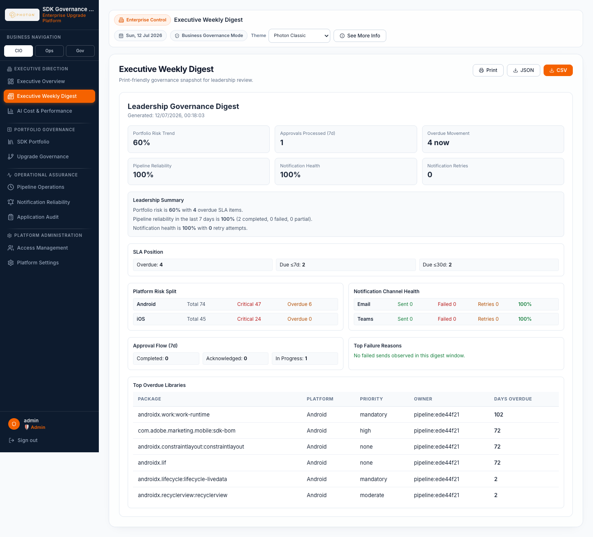

### Application Audit

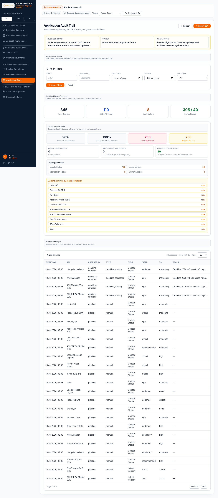

### AI Cost & Performance

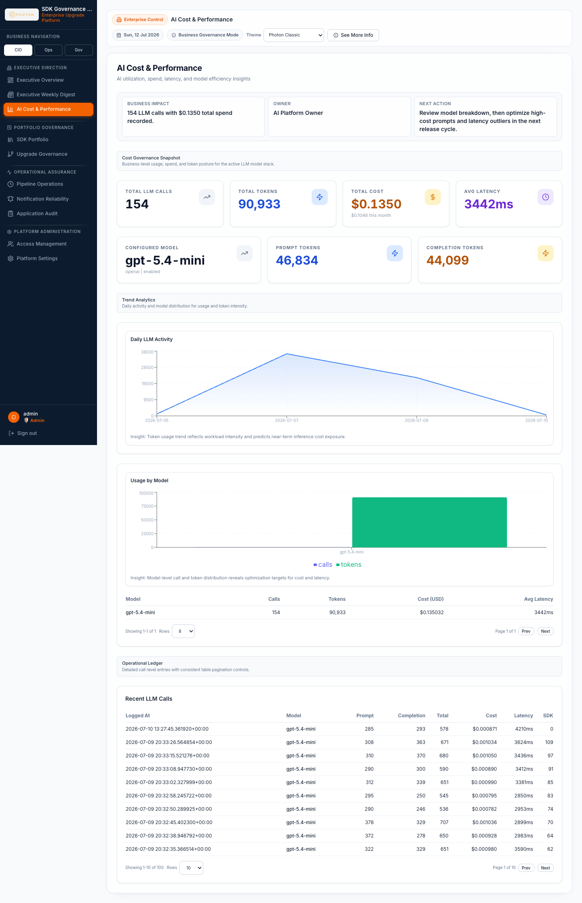

### Platform Settings

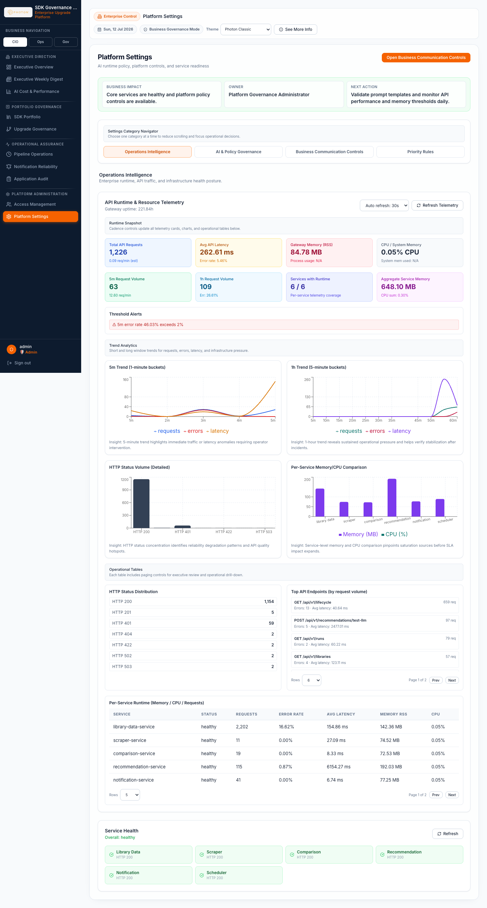

### Access Management

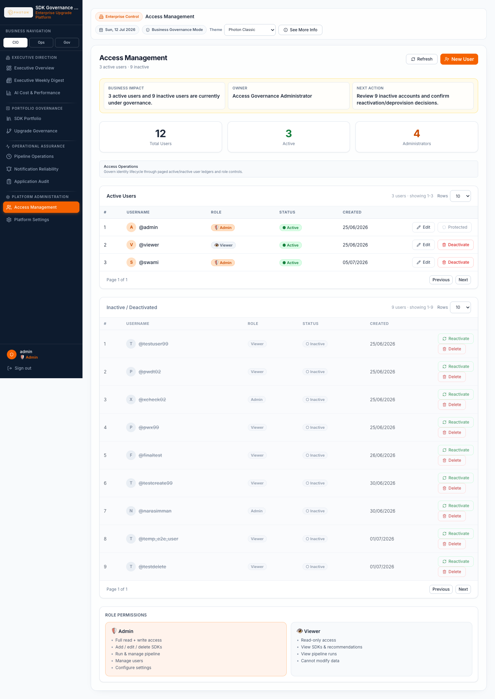