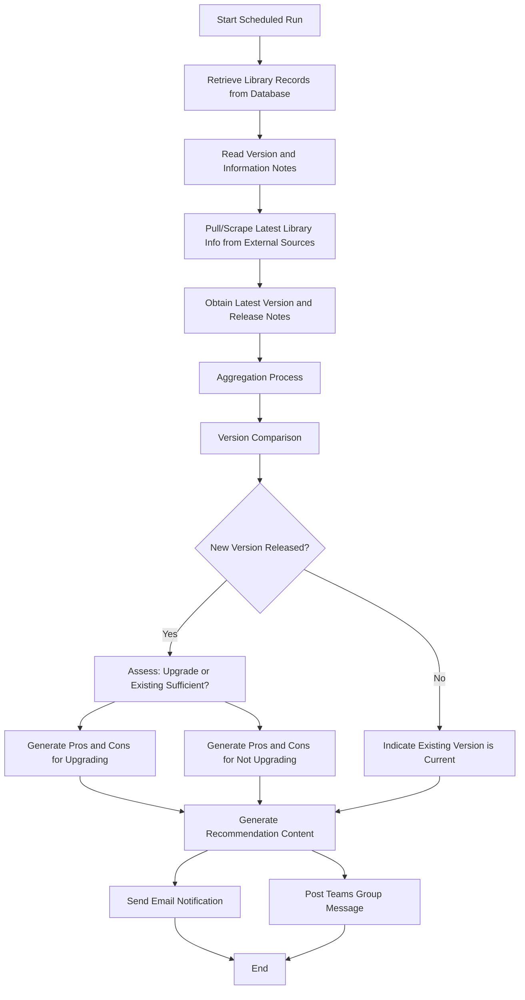
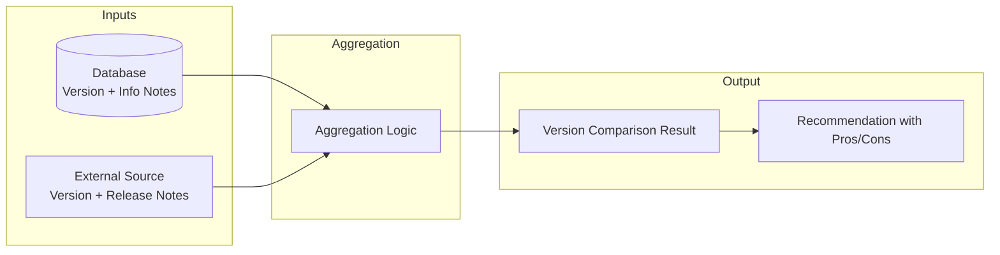
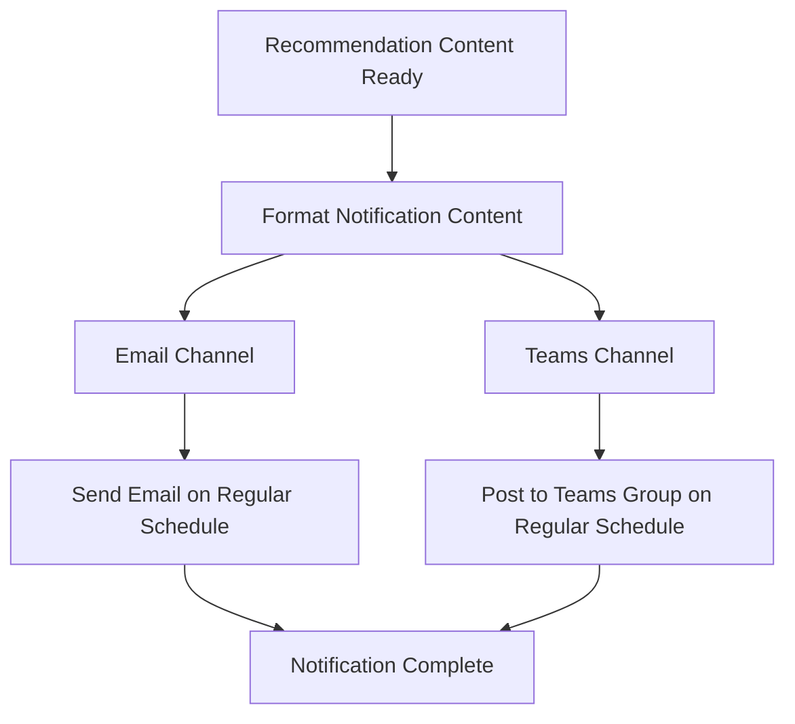
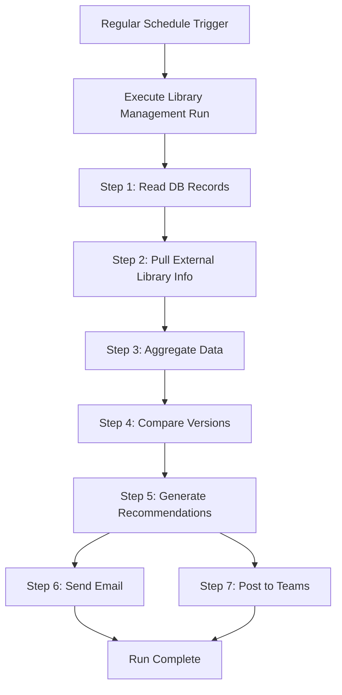

# Library Management Application — Complete Project Documentation

**Document Version:** 1.0  
**Date:** June 24, 2026  
**Prepared For:** Client  
**Project Type:** Organization-wide Library Management Application  
**Development Approach:** Single Developer, Cursor AI Assisted  
**Estimated Timeline:** 4–5 Working Days  

---

## Table of Contents

1. [Business Requirement Document (BRD)](#document-1--business-requirement-document-brd)
2. [Functional Requirement Specification (FRS)](#document-2--functional-requirement-specification-frs)
3. [Feature Breakdown](#document-3--feature-breakdown)
4. [User Stories](#document-4--user-stories)
5. [Use Cases](#document-5--use-cases)
6. [Application Workflow](#document-6--application-workflow)
7. [Data Requirement Document](#document-7--data-requirement-document)
8. [Estimation Document](#document-8--estimation-document)
9. [Development Plan](#document-9--development-plan)
10. [Detailed 5 Day Execution Plan](#document-10--detailed-5-day-execution-plan)
11. [Risks and Assumptions](#document-11--risks-and-assumptions)
12. [Executive Summary](#document-12--executive-summary)

---

# Document 1 — Business Requirement Document (BRD)

## 1.1 Business Overview

The organization uses multiple libraries across its applications. Library versions and related information are currently maintained in a database for libraries already in use. There is a need to develop **one application for library management across the entire organization**.

The application will pull or scrape the latest library information—including version and release notes—from external sources. It will aggregate this information with existing library records stored in the database, compare versions, and determine whether a new version has been released.

Based on the comparison, the application will generate guidance on whether an upgrade is recommended or whether the existing version is sufficient. This guidance will include pros and cons for upgrading and for not upgrading.

The application will regularly distribute this information via **email** and **Microsoft Teams group posts**.

---

## 1.2 Business Objective

| # | Objective |
|---|-----------|
| BO-01 | Centralize library management for the entire organization in one application |
| BO-02 | Automatically obtain the latest library versions and release notes from external sources |
| BO-03 | Compare latest available versions against libraries already recorded in the database |
| BO-04 | Generate clear upgrade guidance, including pros and cons for upgrading and for remaining on the current version |
| BO-05 | Regularly communicate library status and recommendations through email and Teams |

---

## 1.3 Current Process

| # | Current State |
|---|---------------|
| CP-01 | Multiple libraries are used across applications within the organization |
| CP-02 | Libraries already in use are maintained in a database with version and information notes |
| CP-03 | There is no centralized application to pull latest library versions and release notes from external sources |
| CP-04 | There is no automated comparison of external library versions against database records |
| CP-05 | There is no automated generation of upgrade recommendations with pros and cons |
| CP-06 | There is no regular automated notification of library status via email and Teams |

---

## 1.4 Future Process

| Step | Process Description |
|------|---------------------|
| 1 | The application retrieves existing library information (version and information notes) from the database |
| 2 | The application pulls or scrapes the latest library information (version and release notes) from external sources |
| 3 | Aggregation logic compares database records with the latest available information to determine whether a new version has been released |
| 4 | The application generates recommendations: whether the organization can upgrade or whether the existing version is sufficient; pros and cons if upgraded; pros and cons if not upgraded |
| 5 | Based on the generated content, the application sends email notifications and posts messages to a Teams group on a regular schedule |

---

## 1.5 Business Scope

Develop one organization-wide application for library management that supports:

- Version discovery from external sources
- Comparison against existing database records
- Recommendation generation with pros and cons
- Regular notification through email and Teams

---

## 1.6 In Scope

| # | In Scope Item |
|---|---------------|
| IS-01 | Pull or scrape latest library information (version and release notes) for libraries used across applications |
| IS-02 | Read existing library records from the database (version and information notes) |
| IS-03 | Aggregation and comparison logic to detect whether a new version has been released |
| IS-04 | Generation of upgrade guidance: upgrade vs. existing version is sufficient |
| IS-05 | Generation of pros and cons for upgrading |
| IS-06 | Generation of pros and cons for not upgrading |
| IS-07 | Regular email notification based on generated content |
| IS-08 | Regular Teams group post based on generated content |

---

## 1.7 Out of Scope

The following are **not stated** in the business requirement and are therefore out of scope:

| # | Out of Scope Item |
|---|-------------------|
| OS-01 | Enterprise features not described in the requirement |
| OS-02 | Redesign of how libraries are used in existing applications |
| OS-03 | Automated application of library upgrades within consuming applications |
| OS-04 | Features beyond library version tracking, comparison, recommendation, and notification described above |

---

## 1.8 Assumptions

| # | Assumption |
|---|------------|
| A-01 | A database already exists containing library records with version and information notes for libraries in use |
| A-02 | External sources exist from which latest library versions and release notes can be pulled or scraped |
| A-03 | Email and Microsoft Teams are available channels for regular notification |
| A-04 | A regular schedule for notifications will be defined during project execution |
| A-05 | Stakeholders responsible for library decisions will use the generated recommendations |

---

## 1.9 Constraints

| # | Constraint |
|---|------------|
| C-01 | The solution must work with libraries already maintained in the existing database |
| C-02 | The solution must support multiple libraries used across applications |
| C-03 | Notifications must be delivered via both email and Teams group posts |
| C-04 | Recommendations must address upgrade feasibility, sufficiency of the existing version, and pros/cons for both paths |

---

## 1.10 Business Benefits

| Benefit | Description |
|---------|-------------|
| Centralized visibility | One application provides organization-wide visibility into library versions and status |
| Timely awareness | Regular pulls of latest versions and release notes keep the organization informed of new releases |
| Informed decisions | Pros and cons for upgrading and not upgrading support better library management decisions |
| Consistent communication | Regular email and Teams notifications ensure stakeholders receive library updates on a predictable schedule |
| Reduced manual effort | Automated comparison and recommendation generation reduces manual tracking of library versions |

---

## 1.11 Stakeholders

| Stakeholder | Role |
|-------------|------|
| Client / Business Owner | Defines business need; approves requirements and outcomes |
| Application Teams | Use libraries in existing applications; maintain library records in the database |
| Library Management Users | Review version comparison results and upgrade recommendations |
| Notification Recipients | Receive regular email and Teams updates on library status |
| Project Team (Developer) | Delivers the library management application |

---

# Document 2 — Functional Requirement Specification (FRS)

| Requirement ID | Requirement Name | Description |
|----------------|------------------|-------------|
| FR-001 | Library Source Identification | The application shall identify libraries currently in use across applications that require monitoring |
| FR-002 | External Library Information Retrieval | The application shall pull or scrape the latest library information, including version and release notes, from external sources |
| FR-003 | Database Library Record Retrieval | The application shall retrieve existing library records from the database, including version and information notes |
| FR-004 | Library Data Aggregation | The application shall aggregate external library information with existing database library records |
| FR-005 | Version Comparison | The application shall compare the latest available library version against the version recorded in the database to determine whether a new version has been released |
| FR-006 | New Version Detection | The application shall identify when a new library version has been released compared to the version maintained in the database |
| FR-007 | Upgrade Feasibility Assessment | When a new version is released, the application shall determine whether an upgrade can be performed or whether the existing version is sufficient |
| FR-008 | Upgrade Pros and Cons Generation | The application shall generate pros and cons associated with upgrading to the new version |
| FR-009 | No-Upgrade Pros and Cons Generation | The application shall generate pros and cons associated with not upgrading and remaining on the existing version |
| FR-010 | Recommendation Content Generation | The application shall generate recommendation content based on version comparison and pros/cons analysis |
| FR-011 | Email Notification | The application shall send email notifications containing library comparison and recommendation content on a regular basis |
| FR-012 | Teams Group Notification | The application shall post messages to a Teams group containing library comparison and recommendation content on a regular basis |
| FR-013 | Regular Notification Scheduling | The application shall support regularly scheduled delivery of email and Teams notifications based on generated content |
| FR-014 | Release Notes Handling | The application shall obtain and use release notes as part of latest library information retrieval and recommendation generation |
| FR-015 | Information Note Utilization | The application shall use information notes from existing database library records as part of the aggregation and comparison process |

---

# Document 3 — Feature Breakdown

| Feature ID | Feature Name | Description | Priority |
|------------|--------------|-------------|----------|
| F-001 | External Library Pull/Scrape | Pull or scrape latest library version and release notes from external sources for libraries in use | Must Have |
| F-002 | Database Library Read | Retrieve existing library records from the database including version and information notes | Must Have |
| F-003 | Library Data Aggregation | Combine external library data with database library records | Must Have |
| F-004 | Version Comparison Engine | Compare latest version against database version to detect new releases | Must Have |
| F-005 | Upgrade vs. Sufficient Assessment | Determine whether upgrade is possible/recommended or existing version is sufficient | Must Have |
| F-006 | Upgrade Pros and Cons | Generate pros and cons for upgrading to a new version | Must Have |
| F-007 | No-Upgrade Pros and Cons | Generate pros and cons for not upgrading | Must Have |
| F-008 | Recommendation Report Generation | Produce consolidated recommendation content from comparison and analysis | Must Have |
| F-009 | Email Notification | Send regular email with library status and recommendations | Must Have |
| F-010 | Teams Group Post | Post regular messages to Teams group with library status and recommendations | Must Have |
| F-011 | Scheduled Notification | Execute email and Teams notifications on a regular schedule | Must Have |
| F-012 | Release Notes in Output | Include release notes in generated content and notifications | Should Have |
| F-013 | Information Note Reference | Reference database information notes in aggregation and recommendations | Should Have |
| F-014 | Multi-Library Support | Support monitoring of multiple libraries used across applications | Must Have |

---

# Document 4 — User Stories

## US-001 — Retrieve Latest Library Information

**As a** user,  
**I want** the application to pull or scrape the latest library version and release notes from external sources,  
**So that** I have up-to-date information on libraries used across the organization.

**Acceptance Criteria:**

- [ ] The application retrieves latest version for each monitored library
- [ ] The application retrieves release notes for each latest version
- [ ] Retrieved information is available for comparison and recommendation

---

## US-002 — Access Existing Library Records

**As a** user,  
**I want** the application to read existing library records from the database with version and information notes,  
**So that** current organizational library usage is reflected in the analysis.

**Acceptance Criteria:**

- [ ] The application reads library records from the existing database
- [ ] Each record includes version and information notes
- [ ] Retrieved records are used in the aggregation process

---

## US-003 — Compare Library Versions

**As a** user,  
**I want** the application to compare latest library versions against database versions,  
**So that** I know whether a new version has been released.

**Acceptance Criteria:**

- [ ] Aggregation logic combines external and database library data
- [ ] The application identifies when a new version is available
- [ ] The application identifies when the existing version matches the latest version

---

## US-004 — Receive Upgrade Guidance

**As a** user,  
**I want** the application to indicate whether I can upgrade or whether the existing version is sufficient,  
**So that** I can make an informed library management decision.

**Acceptance Criteria:**

- [ ] When a new version is released, the application states whether upgrade is an option
- [ ] The application states when the existing version is sufficient
- [ ] Guidance is included in generated recommendation content

---

## US-005 — Review Upgrade Pros and Cons

**As a** user,  
**I want** the application to generate pros and cons for upgrading,  
**So that** I understand the benefits and risks of moving to a new version.

**Acceptance Criteria:**

- [ ] Pros of upgrading are listed when a new version is available
- [ ] Cons of upgrading are listed when a new version is available
- [ ] Content is based on version and release note information

---

## US-006 — Review No-Upgrade Pros and Cons

**As a** user,  
**I want** the application to generate pros and cons for not upgrading,  
**So that** I understand the benefits and risks of staying on the current version.

**Acceptance Criteria:**

- [ ] Pros of not upgrading are listed
- [ ] Cons of not upgrading are listed
- [ ] Content is included in recommendation output

---

## US-007 — Receive Email Updates

**As a** user,  
**I want** to receive regular email notifications with library comparison and recommendation content,  
**So that** I stay informed without manually checking library versions.

**Acceptance Criteria:**

- [ ] Email is sent on a regular schedule
- [ ] Email contains library version comparison results
- [ ] Email contains upgrade recommendations and pros/cons

---

## US-008 — Receive Teams Updates

**As a** user,  
**I want** to receive regular Teams group posts with library comparison and recommendation content,  
**So that** my team is informed through our collaboration channel.

**Acceptance Criteria:**

- [ ] Messages are posted to a Teams group on a regular schedule
- [ ] Posts contain library version comparison results
- [ ] Posts contain upgrade recommendations and pros/cons

---

# Document 5 — Use Cases

## UC-001 — Pull Latest Library Information

| Field | Detail |
|-------|--------|
| **Use Case Name** | Pull Latest Library Information |
| **Actor** | Application (System) |
| **Preconditions** | Libraries in use are identified; external sources are accessible |
| **Main Flow** | 1. Application identifies libraries to monitor 2. Application pulls or scrapes latest version from external source 3. Application pulls or scrapes release notes for the latest version 4. Latest library information is stored for aggregation |
| **Alternate Flow** | 2a. External source is unavailable — process logs failure and continues with remaining libraries |
| **Post Conditions** | Latest version and release notes are available for comparison |

---

## UC-002 — Retrieve Existing Library Records from Database

| Field | Detail |
|-------|--------|
| **Use Case Name** | Retrieve Existing Library Records |
| **Actor** | Application (System) |
| **Preconditions** | Database contains library records with version and information notes |
| **Main Flow** | 1. Application connects to the database 2. Application retrieves library records for libraries in use 3. Application reads version and information notes for each record 4. Records are prepared for aggregation |
| **Alternate Flow** | 2a. No records found for a library — process flags missing database entry |
| **Post Conditions** | Existing library version and information notes are available for comparison |

---

## UC-003 — Compare Versions and Generate Recommendations

| Field | Detail |
|-------|--------|
| **Use Case Name** | Compare Versions and Generate Recommendations |
| **Actor** | Application (System) |
| **Preconditions** | Latest library information and database records are available |
| **Main Flow** | 1. Application aggregates external and database library data 2. Application compares latest version with database version 3. Application determines if a new version has been released 4. If new version released, application assesses upgrade vs. existing sufficient 5. Application generates pros and cons for upgrading 6. Application generates pros and cons for not upgrading 7. Recommendation content is produced |
| **Alternate Flow** | 3a. No new version released — application indicates existing version is current and generates relevant guidance |
| **Post Conditions** | Recommendation content with comparison results and pros/cons is ready for notification |

---

## UC-004 — Send Regular Email Notification

| Field | Detail |
|-------|--------|
| **Use Case Name** | Send Regular Email Notification |
| **Actor** | Application (System) |
| **Preconditions** | Recommendation content has been generated; email configuration is in place |
| **Main Flow** | 1. Scheduled notification trigger executes 2. Application prepares email content from recommendation output 3. Application sends email to configured recipients 4. Email delivery is confirmed |
| **Alternate Flow** | 3a. Email delivery fails — process logs failure for retry or review |
| **Post Conditions** | Recipients receive library status and recommendation via email |

---

## UC-005 — Post Regular Teams Group Message

| Field | Detail |
|-------|--------|
| **Use Case Name** | Post Regular Teams Group Message |
| **Actor** | Application (System) |
| **Preconditions** | Recommendation content has been generated; Teams group is configured |
| **Main Flow** | 1. Scheduled notification trigger executes 2. Application prepares message content from recommendation output 3. Application posts message to Teams group 4. Post delivery is confirmed |
| **Alternate Flow** | 3a. Teams post fails — process logs failure for retry or review |
| **Post Conditions** | Teams group members receive library status and recommendation |

---

# Document 6 — Application Workflow

## 6.1 Step-by-Step Workflow

### Step 1 — Existing Library Information from Database

- Application retrieves library records from the database
- Each record includes library name, current version, and information notes
- Records represent libraries already in use across applications

### Step 2 — Latest Library Information from External Sources

- Application pulls or scrapes latest library version from external sources
- Application pulls or scrapes release notes for the latest version
- Process repeats for each monitored library

### Step 3 — Aggregation Process

- Application combines database records with externally retrieved library information
- Data is aligned per library for comparison
- Information notes from database are included in aggregated dataset

### Step 4 — Version Comparison

- Application compares latest available version against the version in the database
- Application determines whether a new version has been released
- Comparison result is recorded per library

### Step 5 — Recommendation Generation

- **If a new version is released:**
  - Assess whether upgrade is recommended or existing version is sufficient
  - Generate pros and cons for upgrading
  - Generate pros and cons for not upgrading
- **If no new version is released:**
  - Indicate existing version is current
  - Generate relevant guidance as applicable

### Step 6 — Email Notification

- Application formats recommendation content for email
- Email is sent to configured recipients on a regular schedule

### Step 7 — Teams Notification

- Application formats recommendation content for Teams
- Message is posted to the configured Teams group on a regular schedule

---

## 6.2 Mermaid Workflow Diagram — End-to-End Process

---

## 6.3 Mermaid Workflow Diagram — Aggregation and Comparison

---

## 6.4 Mermaid Workflow Diagram — Notification Flow

---

## 6.5 Mermaid Workflow Diagram — Daily Scheduled Run

---

# Document 7 — Data Requirement Document

| Entity | Description | Attributes |
|--------|-------------|------------|
| Application | Represents an application within the organization that uses libraries | Application ID, Application Name |
| Library | Represents a software library used across applications | Library ID, Library Name, Source Reference |
| Library Version (Database) | Version of a library currently recorded in the database | Version ID, Library ID, Version Number, Record Date |
| Information Note | Notes maintained in the database for a library in use | Note ID, Library ID, Version ID, Information Note Text |
| Latest Library Version (External) | Latest version retrieved from external source | External Version ID, Library ID, Version Number, Retrieval Date |
| Release Notes | Release notes associated with a library version from external source | Release Note ID, Library ID, Version Number, Release Note Content, Source Date |
| Version Comparison Result | Outcome of comparing database version with latest external version | Comparison ID, Library ID, Database Version, Latest Version, New Version Released (Yes/No), Comparison Date |
| Recommendation | Generated guidance on upgrade decision | Recommendation ID, Library ID, Comparison ID, Upgrade Recommended (Yes/No/Existing Sufficient), Recommendation Summary |
| Upgrade Pros | Benefits of upgrading to new version | Pro ID, Recommendation ID, Pro Description |
| Upgrade Cons | Risks or drawbacks of upgrading | Con ID, Recommendation ID, Con Description |
| No-Upgrade Pros | Benefits of remaining on current version | Pro ID, Recommendation ID, Pro Description |
| No-Upgrade Cons | Risks or drawbacks of not upgrading | Con ID, Recommendation ID, Con Description |
| Notification | Record of a sent notification | Notification ID, Recommendation ID, Notification Type (Email/Teams), Sent Date, Status |
| Email Notification | Email sent with library recommendation content | Email ID, Notification ID, Recipient, Subject, Body, Sent Date |
| Teams Notification | Message posted to Teams group | Teams Post ID, Notification ID, Group Reference, Message Content, Posted Date |
| Notification Schedule | Defines regular notification timing | Schedule ID, Frequency, Last Run Date, Next Run Date |

---

# Document 8 — Estimation Document

## 8.1 Estimation Assumptions

| Assumption | Value |
|------------|-------|
| Team Size | 1 Developer |
| Working Hours Per Day | 8 hours |
| Development Tool | Cursor AI Assisted Development |
| **Total Project Duration** | **4–5 Working Days** |
| **Total Estimated Hours** | **32–40 Hours** |

---

## 8.2 Module-wise Estimation

| Module | Task | Estimated Hours | Owner |
|--------|------|-----------------|-------|
| Requirement Analysis | Review and validate business requirements | 2 | Developer |
| Requirement Analysis | Document BRD, FRS, user stories | 2 | Developer |
| Database Design | Design data model and map existing DB library records | 2 | Developer |
| UI Development | Develop views for library status, comparison, and recommendations | 4 | Developer |
| Backend Development | Develop core services and scheduled workflow | 6 | Developer |
| Backend Development | Develop database read integration for existing library records | 2 | Developer |
| Library Scraper | Develop pull/scrape for latest version and release notes | 6 | Developer |
| Library Scraper | Support multiple library sources | 2 | Developer |
| Comparison Logic | Develop aggregation logic combining DB and external data | 3 | Developer |
| Comparison Logic | Develop version comparison to detect new releases | 2 | Developer |
| Recommendation Engine | Develop upgrade vs. sufficient assessment logic | 3 | Developer |
| Recommendation Engine | Develop pros and cons generation for upgrade and no-upgrade | 3 | Developer |
| Email Integration | Configure and implement regular email notification | 2 | Developer |
| Teams Integration | Configure and implement regular Teams group post | 2 | Developer |
| Testing | Unit, integration, and end-to-end workflow testing | 4 | Developer |
| Deployment | Environment setup and deployment | 2 | Developer |
| Documentation | User and project documentation | 1 | Developer |

---

## 8.3 Estimation Summary

| Metric | Value |
|--------|-------|
| **Total Hours** | **40 hours** |
| **Total Days** (8 hrs/day) | **5 days** |
| **Minimum Viable Delivery** | **4 days (32 hours)** — if notification integrations are streamlined |
| **Recommended Delivery** | **5 days (40 hours)** — includes full testing and documentation |

---

## 8.4 Day-wise Hour Distribution

| Day | Focus Area | Hours |
|-----|------------|-------|
| Day 1 | Requirement Analysis, Design, Database Integration | 8 |
| Day 2 | Library Scraper, Aggregation, Version Comparison | 8 |
| Day 3 | Recommendation Engine, Backend Services | 8 |
| Day 4 | Email Integration, Teams Integration, UI | 8 |
| Day 5 | Testing, Deployment, Documentation | 8 |
| **Total** | | **40** |

---

# Document 9 — Development Plan

## 9.1 Plan Assumptions

| Assumption | Value |
|------------|-------|
| Team Size | 1 Developer |
| Tooling | Cursor AI Assisted Development |
| Working Hours | 8 hours per day |
| **Total Duration** | **4–5 Working Days** |

---

## 9.2 Phase-wise Development Plan

| Phase | Task | Deliverable | Owner | Duration |
|-------|------|-------------|-------|----------|
| **Phase 1 — Requirement Analysis** | Review and validate business requirements with client | Validated requirement baseline | Developer | 0.5 day |
| Phase 1 | Finalize BRD, FRS, user stories, use cases | Requirement documentation | Developer | 0.5 day |
| **Phase 2 — Design** | Design data model and database integration | Data requirement document | Developer | 0.5 day |
| Phase 2 | Design application workflow and notification approach | Workflow and feature documentation | Developer | 0.5 day |
| **Phase 3 — Development** | Develop database read for existing library records | Database integration module | Developer | 0.5 day |
| Phase 3 | Develop library pull/scrape for version and release notes | Library scraper module | Developer | 1 day |
| Phase 3 | Develop aggregation and version comparison logic | Comparison module | Developer | 0.5 day |
| Phase 3 | Develop recommendation engine (upgrade/sufficient, pros/cons) | Recommendation module | Developer | 1 day |
| Phase 3 | Develop email and Teams notification integration | Notification modules | Developer | 0.5 day |
| Phase 3 | Develop UI and backend scheduled execution | Application UI and backend | Developer | 1 day |
| **Phase 4 — Testing** | Unit, integration, and end-to-end testing | Test results and sign-off | Developer | 0.5 day |
| **Phase 5 — Deployment** | Deploy application and finalize documentation | Deployed application and docs | Developer | 0.5 day |

---

## 9.3 Timeline Summary

| Phase | Duration |
|-------|----------|
| Phase 1 — Requirement Analysis | 1 day |
| Phase 2 — Design | 1 day |
| Phase 3 — Development | 2.5 days |
| Phase 4 — Testing | 0.5 day |
| Phase 5 — Deployment | 1 day |
| **Total** | **5 working days** |

> **4-day option:** Compress testing and documentation into half-day blocks and parallelize UI with notification development on Day 4 to deliver in 4 days (32 hours).

---

# Document 10 — Detailed 5 Day Execution Plan

| Day | Activities | Deliverables | Owner |
|-----|------------|--------------|-------|
| **Day 1** | Review business requirements; finalize BRD and FRS; design data entities and workflow; set up project structure; develop database read integration for existing library records (version, information notes) | BRD, FRS (final), Data model, Database integration module | Developer |
| **Day 2** | Develop library pull/scrape module for latest version and release notes; support multiple libraries; develop aggregation logic; develop version comparison to detect new releases | Library scraper module, Aggregation module, Comparison module | Developer |
| **Day 3** | Develop recommendation engine: upgrade vs. existing sufficient assessment; generate pros and cons for upgrading; generate pros and cons for not upgrading; develop backend scheduled workflow | Recommendation module, Backend services, Scheduled run logic | Developer |
| **Day 4** | Implement email notification with generated content; implement Teams group post with generated content; develop UI to display library status, comparison results, and recommendations | Email integration, Teams integration, Application UI | Developer |
| **Day 5** | Execute unit and integration testing; run end-to-end workflow test (DB read → scrape → compare → recommend → notify); deploy application; finalize project documentation and handover | Tested application, Deployed application, Final documentation | Developer |

---

## 10.1 Day 1 — Detailed Breakdown

| Time Block | Activity |
|------------|----------|
| Morning | Validate requirements; confirm in-scope libraries and notification schedule |
| Midday | Design data entities; design workflow; create project structure |
| Afternoon | Implement database connection and read library records (version, information notes) |

**Deliverables:** Requirement docs finalized, data model, DB integration working

---

## 10.2 Day 2 — Detailed Breakdown

| Time Block | Activity |
|------------|----------|
| Morning | Build pull/scrape module for external library version and release notes |
| Midday | Extend scraper for multiple libraries |
| Afternoon | Build aggregation logic and version comparison engine |

**Deliverables:** Scraper module, aggregation module, comparison module

---

## 10.3 Day 3 — Detailed Breakdown

| Time Block | Activity |
|------------|----------|
| Morning | Build upgrade vs. sufficient assessment logic |
| Midday | Build pros/cons generation for upgrade and no-upgrade paths |
| Afternoon | Build backend services and scheduled execution trigger |

**Deliverables:** Recommendation engine, backend workflow

---

## 10.4 Day 4 — Detailed Breakdown

| Time Block | Activity |
|------------|----------|
| Morning | Implement email notification with recommendation content |
| Midday | Implement Teams group post with recommendation content |
| Afternoon | Build UI for library status, comparison, and recommendations |

**Deliverables:** Email module, Teams module, UI

---

## 10.5 Day 5 — Detailed Breakdown

| Time Block | Activity |
|------------|----------|
| Morning | Unit and integration testing across all modules |
| Midday | End-to-end test: full workflow from DB read to notification |
| Afternoon | Deploy application; finalize and hand over documentation |

**Deliverables:** Tested and deployed application, final documentation

---

# Document 11 — Risks and Assumptions

## 11.1 Risks

| Risk | Impact | Mitigation |
|------|--------|------------|
| External library sources change format or become unavailable | High — latest version and release notes cannot be retrieved | Monitor source availability; log failures; notify stakeholders when retrieval fails |
| Existing database records are incomplete or outdated | Medium — comparison results may be inaccurate | Validate database records during Day 1 setup; flag missing or inconsistent records |
| Release notes lack sufficient detail for pros/cons generation | Medium — recommendation quality may be reduced | Use available version and release note content; clearly state when information is limited |
| Email or Teams delivery failure | Medium — stakeholders miss regular updates | Log notification failures; implement retry; monitor delivery status |
| Multiple libraries across applications increase scope within 5-day window | Medium — risk of incomplete delivery | Prioritize libraries in use; process core libraries first; extend only with client approval |
| Tight 4–5 day timeline limits testing depth | Medium — undetected defects at launch | Focus testing on end-to-end workflow on Day 5; prioritize critical path validation |

---

## 11.2 Assumptions

| Assumption | Description |
|------------|-------------|
| A-001 | A database already exists with library records including version and information notes |
| A-002 | External sources are available to pull or scrape latest library version and release notes |
| A-003 | Email infrastructure is available for sending regular notifications |
| A-004 | A Microsoft Teams group exists and is accessible for regular posts |
| A-005 | The organization will define notification recipients and Teams group during Day 1 setup |
| A-006 | A regular notification schedule will be agreed with the client during Day 1 |
| A-007 | One developer using Cursor AI will deliver the application in 4–5 working days |
| A-008 | Libraries in use across applications are identifiable at project start |
| A-009 | Cursor AI assisted development accelerates coding, allowing delivery within the 5-day window |

---

# Document 12 — Executive Summary

## 12.1 What Problem Is Being Solved

The organization uses multiple libraries across its applications. Library versions and notes are maintained in a database, but there is no centralized application to automatically track new releases, compare versions, generate upgrade guidance, and communicate findings to stakeholders. Manual tracking of library versions across the organization is inefficient and increases the risk of missing important updates.

---

## 12.2 What the Application Will Do

The application will:

1. **Pull or scrape** the latest library versions and release notes from external sources for libraries in use
2. **Read** existing library records from the database, including version and information notes
3. **Aggregate and compare** external data with database records to detect whether a new version has been released
4. **Generate recommendations** indicating whether an upgrade is appropriate or the existing version is sufficient, including pros and cons for upgrading and for not upgrading
5. **Send regular notifications** via email and Microsoft Teams group posts with the generated content

---

## 12.3 Expected Business Value

| Value Area | Benefit |
|------------|---------|
| Centralized management | One application for organization-wide library visibility |
| Timely awareness | Automated detection of new library releases |
| Informed decisions | Structured upgrade guidance with pros and cons |
| Consistent communication | Regular email and Teams updates on a predictable schedule |
| Reduced manual effort | Automated comparison and recommendation generation |

---

## 12.4 Estimated Effort

| Metric | Estimate |
|--------|----------|
| Team Size | 1 Developer (Cursor AI assisted) |
| Total Hours | 32–40 hours |
| Total Days | **4–5 working days** |
| Hours Per Day | 8 hours |

---

## 12.5 Timeline

| Phase | Duration |
|-------|----------|
| Day 1 — Requirement Analysis, Design, Database Integration | 1 day |
| Day 2 — Library Scraper, Aggregation, Comparison | 1 day |
| Day 3 — Recommendation Engine, Backend Services | 1 day |
| Day 4 — Email, Teams, UI | 1 day |
| Day 5 — Testing, Deployment, Documentation | 1 day |
| **Total** | **5 working days** |

---

## 12.6 Deliverables

| # | Deliverable |
|---|-------------|
| 1 | Library Management Application |
| 2 | Library pull/scrape capability for latest version and release notes |
| 3 | Database integration for existing library records |
| 4 | Aggregation and version comparison logic |
| 5 | Recommendation engine with upgrade/sufficient assessment and pros/cons |
| 6 | Regular email notification |
| 7 | Regular Teams group notification |
| 8 | Project documentation (this document) |

---

## 12.7 Success Criteria

| # | Criteria |
|---|----------|
| SC-01 | Application reads existing library records from database with version and information notes |
| SC-02 | Application pulls/scrapes latest library version and release notes from external sources |
| SC-03 | Application compares versions and detects new releases |
| SC-04 | Application generates upgrade guidance with pros and cons for both upgrade and no-upgrade paths |
| SC-05 | Application sends regular email notifications with generated content |
| SC-06 | Application posts regular messages to Teams group with generated content |
| SC-07 | Application delivered within 4–5 working days |

---

*End of Document*
