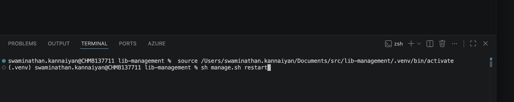

# Project Screenshots

This page keeps the project screenshots used for GitHub documentation in one place.

## Local Service Restart Command

The screenshot below records the terminal context for restarting the local library management services from the project root after activating the Python virtual environment.



Command shown:

```sh
source /Users/swaminathan.kannaiyan/Documents/src/lib-management/.venv/bin/activate
sh manage.sh restart
```